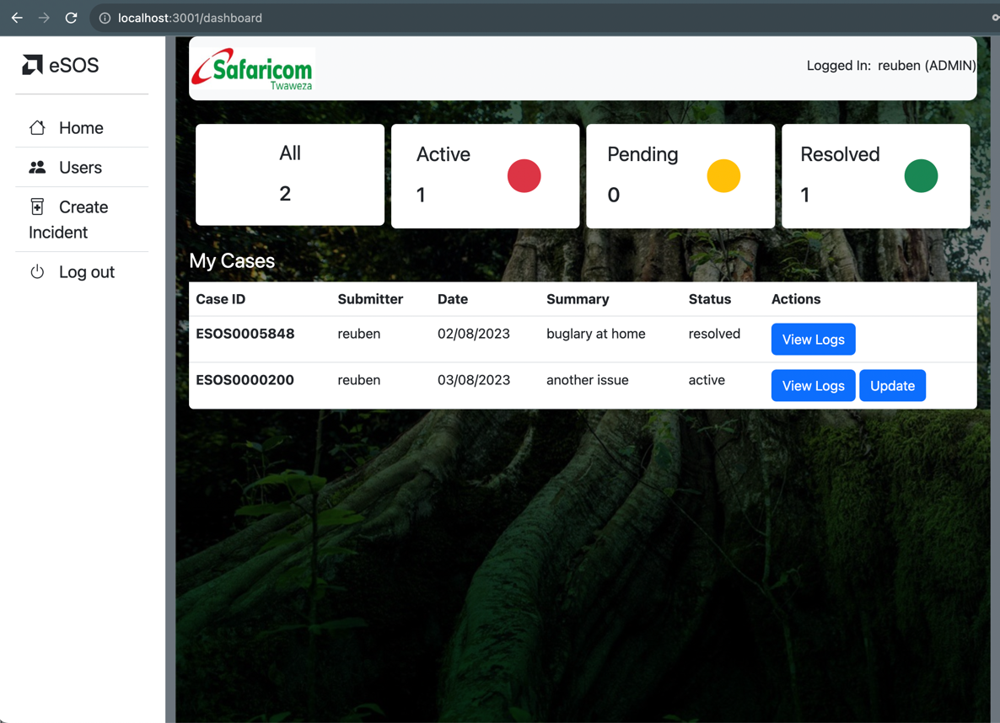

# Project : Emergency SOS (eSOS)

## Project description.

The project shows a web application that allows employees to report health and security incidents.
the incidents have a visibility of their direct manager.

## Author

### Lawrence Karani , Chris Okeyo  Reuben Ngururu & Hellen Waweru

## Setup instructions

- Clone the repository by running the following command
  > ```sh
  >    git clone https://github.com/Zelawlaw/Esos-backend-capstone.git
  > ```
- Create a database named esos on mysql database
- ensure that the following entries on Application properties are entered.
- The note the entry  *spring.jpa.hibernate.ddl-auto* which is set to update and will genereate the database tables for
  you from the entities.

> ```sh
> spring.datasource.url=jdbc:mysql://127.0.0.1:3306/esos
> spring.datasource.username=*your username*
> spring.datasource.password=*your password*
> spring.datasource.driver-class-name=com.mysql.cj.jdbc.Driver
> spring.jpa.hibernate.ddl-auto=update
> ```

build the project.

run the build the docker file image and run the container
> ```sh
> # Build the Docker image
> docker build -t esos-frontend-app .
>
> # Run the Docker container, forwarding port 3001 on the host to port 80 inside the container
> docker run -p 3001:80 esos-frontend-app
> ```
## BDD

As a user, I would like to;

1) log in to the application using credentials
2) create users if admin
3) view users
4) assign users to a manager if desired
5) create an incident
6) update logs to an incident
7) view logs


## Expected view

Here is how it will look like upon successful installation and some sightings added


## Technologies used.

- Spring boot
- Gradle
- Lombok
- CSS
- Mustache
- PostGreSQL

## Contact information.

lawrence.karani@student.moringaschool.com

## License and Copyright information.

[MIT License](https://github.com/nishanths/license/blob/master/LICENSE)